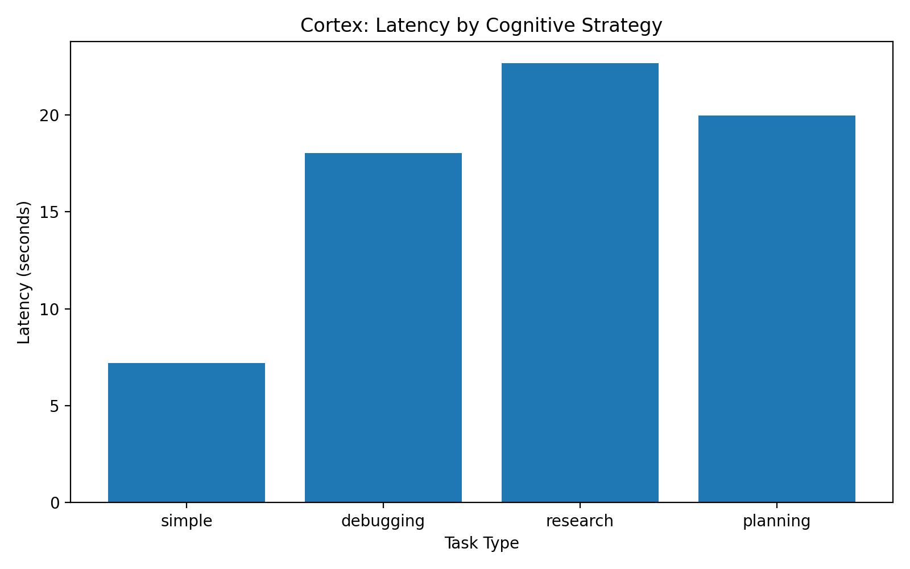
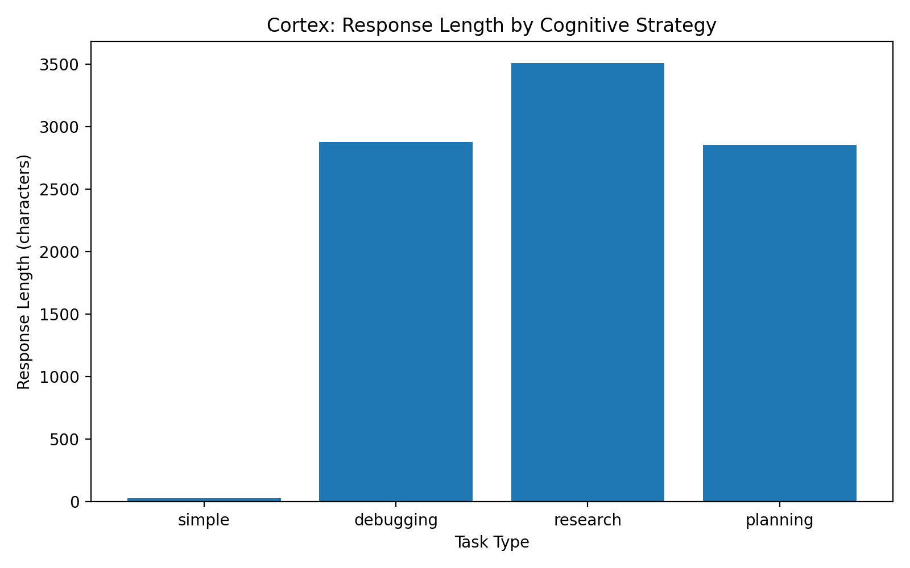

# Cortex

> A lightweight, model-agnostic test-time cognition layer that dynamically allocates reasoning effort based on estimated task difficulty and uncertainty.

Cortex is a small experimental controller built around a simple question:

**Should every LLM prompt receive the same amount of inference-time reasoning?**

Instead of applying one reasoning strategy to every query, Cortex estimates task complexity and routes prompts through one of three compute policies:

- **Direct** for simple factual questions
- **Deliberate** for debugging and bounded analysis
- **Deep** for architecture, planning, research, and multi-step reasoning tasks

The base model is not retrained or fine-tuned. Cortex operates outside model weights and changes only the inference-time workflow.

## Architecture

```text
                     User Query
                         |
                         v
              Cognitive Controller
          difficulty + uncertainty estimate
                         |
          +--------------+--------------+
          |              |              |
       Direct        Deliberate        Deep
          |              |              |
     concise answer   structured     decompose
                      analysis       compare
                                     critique
                                     recommend
                         |
                         v
                    Local LLM
```

## How it works

1. The controller asks the model to estimate task difficulty and uncertainty.
2. Cortex computes an effort score:

```text
effort_score = 0.7 × difficulty + 0.3 × uncertainty
```

3. The controller selects a reasoning policy:

| Effort score | Strategy | Intended use |
|---|---|---|
| Below 0.30 | Direct | Factual recall and simple transformations |
| 0.30 to 0.55 | Deliberate | Debugging, explanations, bounded analysis |
| 0.55 or higher | Deep | System design, planning, research, multi-step reasoning |

4. The selected policy changes the prompt and inference workflow without changing model weights.

## Example routing

| Task | Strategy selected |
|---|---|
| “What is the capital of France?” | Direct |
| “Why could a distributed database become inconsistent during a network partition?” | Deliberate |
| “Design a cognitive architecture that improves AI reasoning without retraining the model.” | Deep |
| “Create a strategy for scaling an AI startup from prototype to enterprise customers.” | Deep |

## Benchmark observation

The benchmark was run locally with `llama3.2` through Ollama.

| Task type | Observed latency | Response length |
|---|---:|---:|
| Simple | 7.21 seconds | 31 characters |
| Debugging | 18.02 seconds | 2,876 characters |
| Research/design | 22.66 seconds | 3,508 characters |
| Planning | 19.98 seconds | 2,856 characters |

The goal is not to claim a quality improvement from four examples. The observed behavior is that Cortex routed a simple task to minimal inference while assigning deeper inference-time workflows to open-ended tasks.





## Project structure

```text
Cortex/
├── cortex/
│   ├── controller.py          # Difficulty and uncertainty estimator
│   ├── reasoning_engine.py    # Adaptive inference routing
│   ├── ollama_client.py       # Local model interface
│   └── evaluator.py           # Latency and response-size tracking
├── benchmarks/
│   ├── questions.json
│   ├── run_benchmark.py
│   ├── plot_results.py
│   ├── summary.csv
│   └── results.csv
├── assets/
│   ├── latency_by_task.png
│   └── response_length_by_task.png
├── demo.py
├── requirements.txt
└── README.md
```

## Run locally

### 1. Install dependencies

```bash
python3 -m pip install -r requirements.txt
```

### 2. Install and start Ollama

```bash
brew install ollama
brew services start ollama
ollama pull llama3.2
```

### 3. Run the demo

```bash
python3 demo.py
```

### 4. Run the benchmark

```bash
python3 -m benchmarks.run_benchmark
python3 benchmarks/plot_results.py
```

## Limitations

- This is a proof of concept, not a trained routing policy.
- Difficulty and uncertainty are self-estimated by the underlying model, so routing can be noisy.
- Latency includes local hardware and Ollama runtime overhead.
- The benchmark measures routing behavior and compute allocation, not validated answer correctness.
- A stronger version would use calibrated uncertainty, answer verification, task-specific evaluators, and controlled comparisons against fixed-compute baselines.

## Inspiration

This project was inspired by the broader idea of test-time cognition: allocating inference-time effort adaptively instead of treating every prompt as equally difficult.