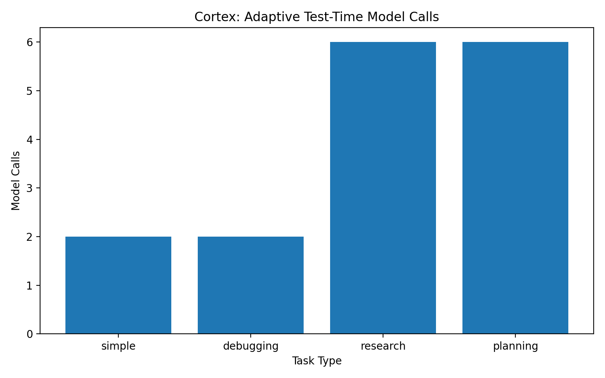
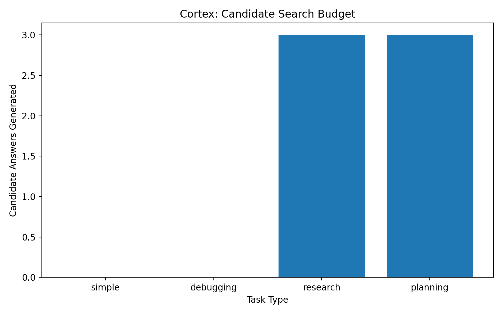

# Cortex

> A lightweight, model-agnostic test-time cognition prototype that adaptively allocates inference-time computation based on estimated task difficulty and uncertainty.

Cortex explores a simple question:

**Should every LLM prompt receive the same inference-time budget?**

Instead of applying one reasoning workflow to every request, Cortex estimates task complexity and routes prompts through one of three policies:

- **Direct** for simple factual questions
- **Deliberate** for debugging and bounded analysis
- **Deep** for architecture, planning, research, and multi-step reasoning tasks, using candidate search, verifier selection, and constraint enforcement

The base model is not retrained or fine-tuned. Cortex operates outside model weights and changes only the inference-time workflow.

## Architecture

```text
                     User Query
                         |
                         v
              Cognitive Controller
          difficulty + uncertainty estimate
                         |
          +--------------+--------------+
          |              |              |
       Direct        Deliberate        Deep
          |              |              |
     concise answer   structured     generate candidates
                      analysis       verify candidates
                                     enforce constraints
                         |
                         v
                    Local LLM
```

## How it works

1. Cortex asks the underlying model to estimate task difficulty and uncertainty.
2. It computes an effort score:

```text
effort_score = 0.7 × difficulty + 0.3 × uncertainty
```

3. The controller selects a reasoning policy:

| Effort score | Strategy | Intended use |
|---|---|---|
| Below 0.30 | Direct | Factual recall and simple transformations |
| 0.30 to 0.50 | Deliberate | Debugging, explanations, bounded analysis |
| 0.50 or higher | Deep | System design, planning, research, multi-step reasoning |

4. The selected policy controls the inference-time workflow without changing model weights.

## Deep workflow

For high-effort tasks, Cortex performs selective test-time search:

```text
Query
  |
  v
Controller routes to Deep
  |
  v
Generate 3 candidate answers
  |
  v
Verifier scores candidates
  |
  v
Select best candidate
  |
  v
Constraint editor checks fixed-weight requirements
  |
  v
Return final answer
```

The deep workflow is designed to use extra inference-time compute only when the controller determines that the task justifies it.

## Example routing

| Task | Strategy selected |
|---|---|
| “What is the capital of France?” | Direct |
| “Why could a distributed database become inconsistent during a network partition?” | Deliberate |
| “Design a cognitive architecture that improves AI reasoning without retraining the model.” | Deep |
| “Create a strategy for scaling an AI startup from prototype to enterprise customers.” | Deep |

## Adaptive test-time search benchmark

The benchmark was run locally with `llama3.2` through Ollama. It measures routing behavior and test-time compute allocation, not validated answer correctness.

| Task type | Strategy | Model calls | Candidate answers | Verifier score | Observed latency |
|---|---|---:|---:|---:|---:|
| Simple | Direct | 2 | 0 | — | 2.45 seconds |
| Debugging | Deliberate | 2 | 0 | — | 14.67 seconds |
| Research/design | Deep | 6 | 3 | 0.75 | 71.47 seconds |
| Planning | Deep | 6 | 3 | 0.80 | 107.49 seconds |

For direct and deliberate tasks, Cortex uses one controller call and one answer call.

For deep tasks, it uses:

1. Controller analysis
2. Three distinct candidate-generation calls
3. A verifier call to select the strongest candidate
4. A constraint-editor call to ensure the selected answer remains within fixed-weight inference-time methods

This experiment does not claim that deeper search universally improves answer quality. It demonstrates that Cortex allocates additional test-time computation only when its routing policy selects a high-effort strategy.






## Project structure

```text
Cortex/
├── cortex/
│   ├── controller.py          # Difficulty and uncertainty estimator
│   ├── reasoning_engine.py    # Adaptive routing and selective search
│   ├── ollama_client.py       # Local model interface
│   └── evaluator.py           # Benchmark metadata collection
├── benchmarks/
│   ├── questions.json
│   ├── run_benchmark.py
│   ├── plot_results.py
│   ├── summary.csv
│   └── results.csv
├── assets/
│   ├── latency_by_task.png
│   ├── model_calls_by_task.png
│   └── candidate_budget_by_task.png
├── demo.py
├── requirements.txt
└── README.md
```

## Run locally

### 1. Install dependencies

```bash
python3 -m pip install -r requirements.txt
```

### 2. Install and start Ollama

```bash
brew install ollama
brew services start ollama
ollama pull llama3.2
```

### 3. Run the demo

```bash
python3 demo.py
```

### 4. Run the benchmark

```bash
python3 -m benchmarks.run_benchmark
python3 benchmarks/plot_results.py
```

## Limitations

- This is a proof of concept, not a trained routing policy.
- Difficulty and uncertainty are self-estimated by the underlying model, so routing can be noisy.
- The verifier is also an LLM call and can make incorrect selections.
- Latency includes local hardware and Ollama runtime overhead.
- The benchmark measures routing behavior and compute allocation, not objectively validated answer correctness.
- A stronger version would use calibrated uncertainty, task-specific validators, external tools, fixed-compute baselines, and controlled quality comparisons.

## Inspiration

This project was inspired by the broader idea of test-time cognition: allocating inference-time effort adaptively instead of treating every prompt as equally difficult.